# Project Documentation

# theCourseApp - [thecourseapp.in](https://thecourseapp.in)

#### An e-learning platform, where students can learn and teachers can create. To connect those who love learning with those with a passion for teaching.

[devvrat2311/TheCourseApp](https://github.com/devvrat2311/TheCourseApp) **_(Github)_**
[thecourseapp.in](https://thecourseapp.in) **_(Live Demo)_**

## Tech Stack

**_Frontend_**
  

**_Backend_**
    

**_DevOps_**
   

### What is it?

A full stack e-learning platform where students can en-roll in courses, track progress throughout the text and quiz-based content, while instructors can manage course creation with a dedicated dashboard. Built this project to understand multi-role authentication and complex state management.

### Screenshots

#### Login/Sign Up Page

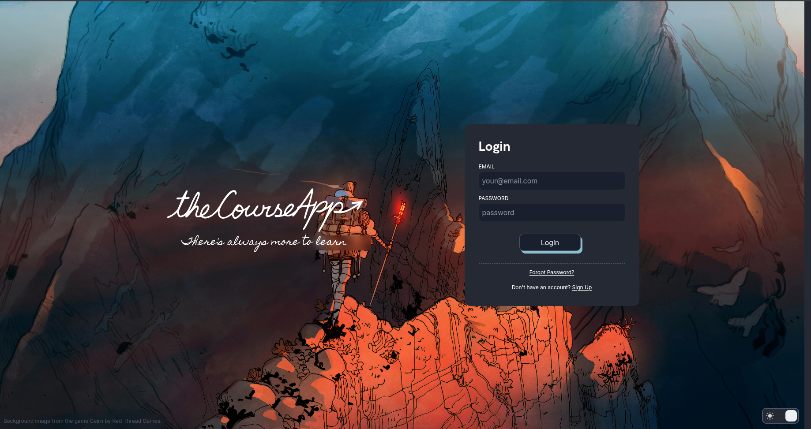

#### Student Account

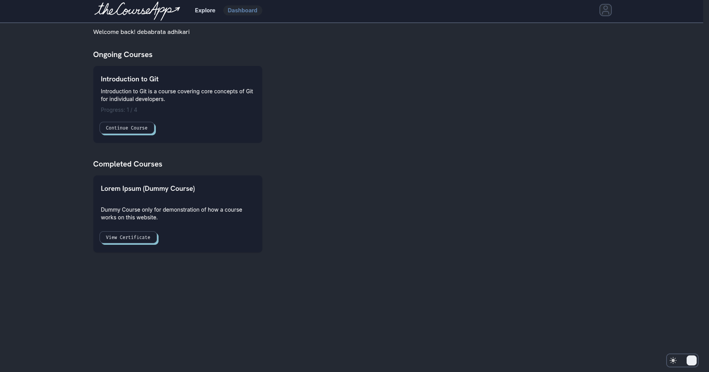
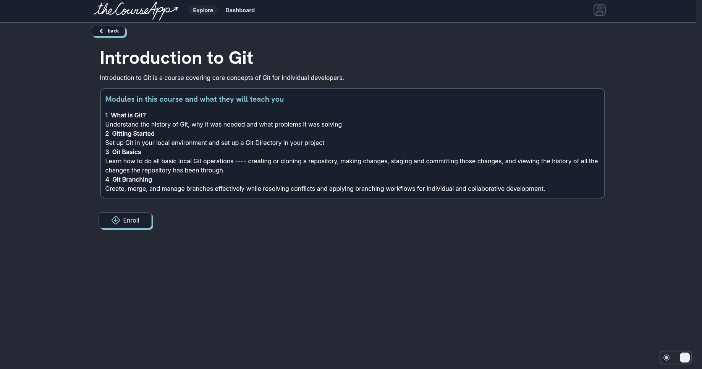
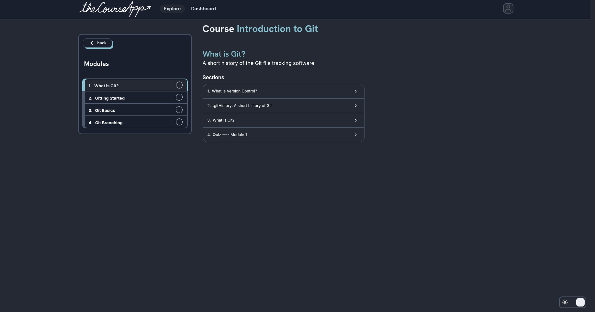
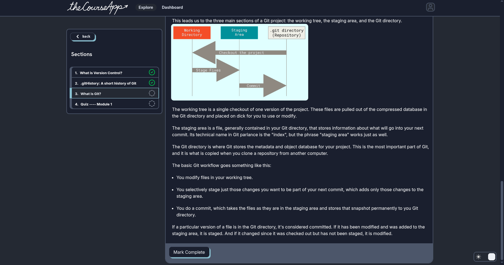
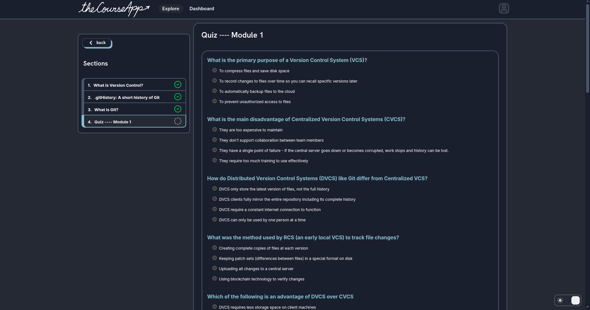

#### Instructor Account

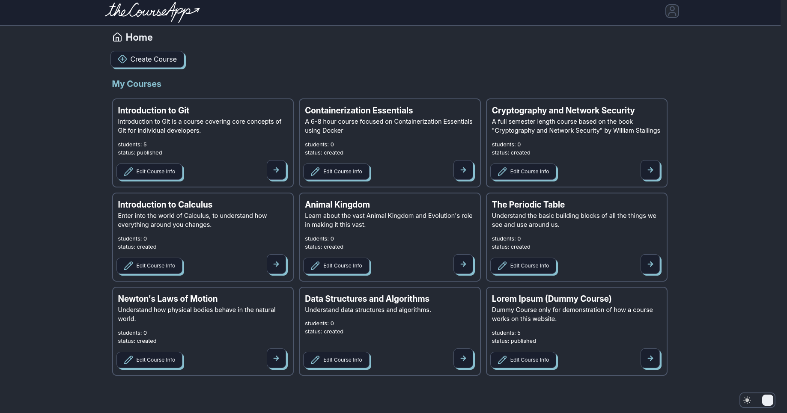
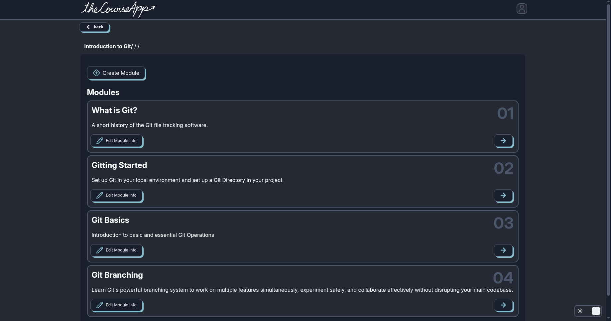
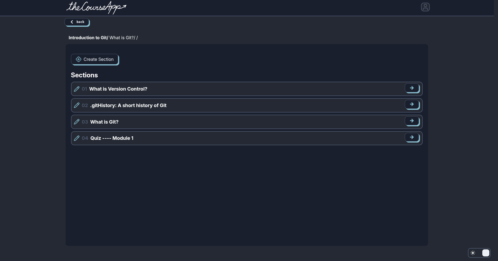
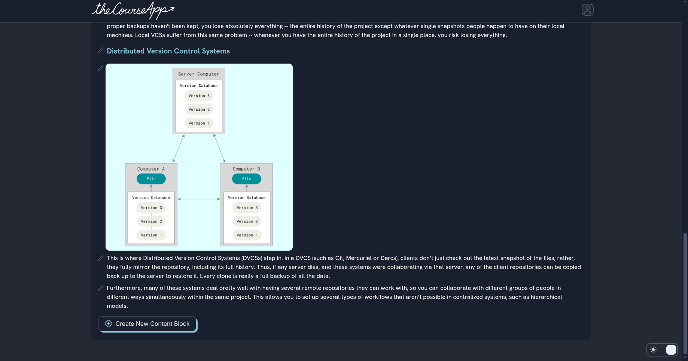
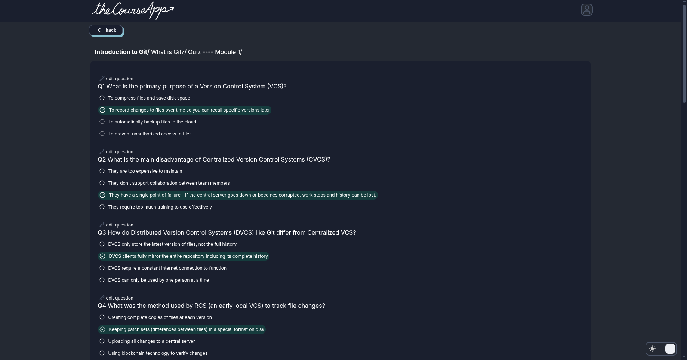

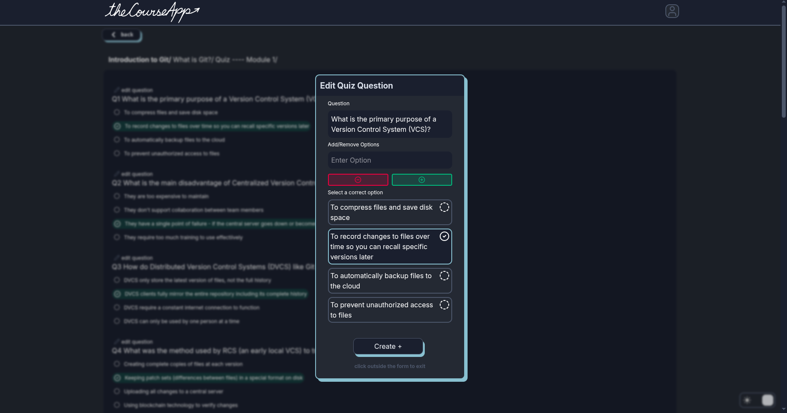
